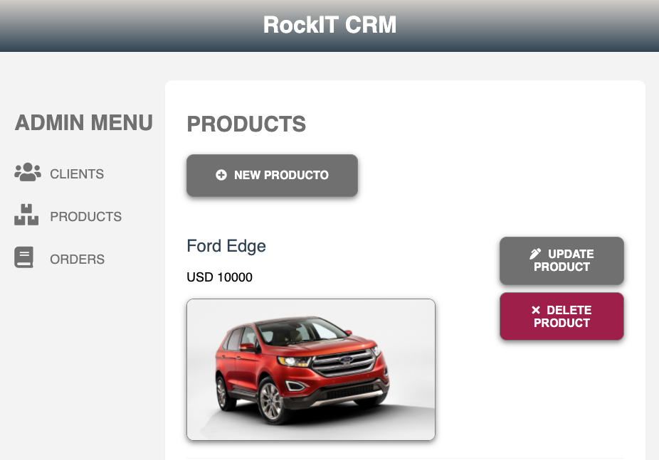
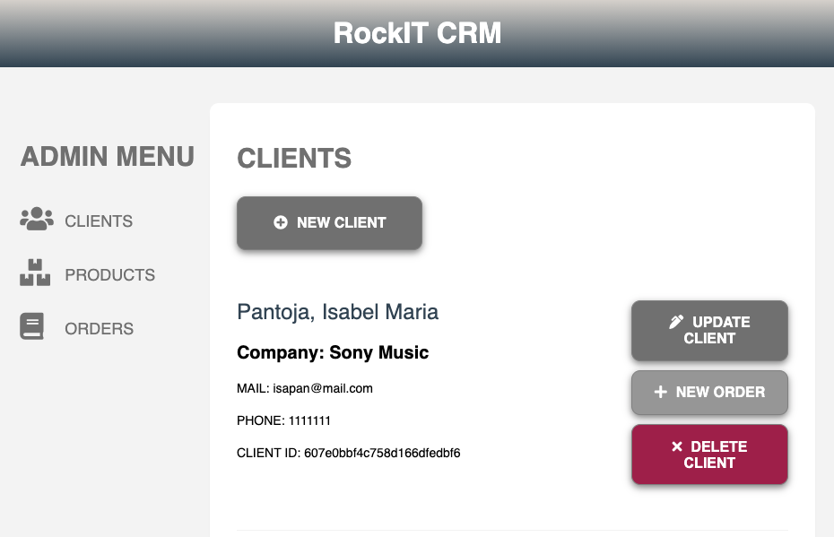

C.R.M.  with React Js at the Frontend, and Node, Express and Mongo at the Backend. 

- [x] Clients, Products and Orders C.R.U.D.
- [x] Spinner
- [x] SweetAlert2
- [x] Mongo
- [x] Express
- [x] React
- [x] NodeJs

